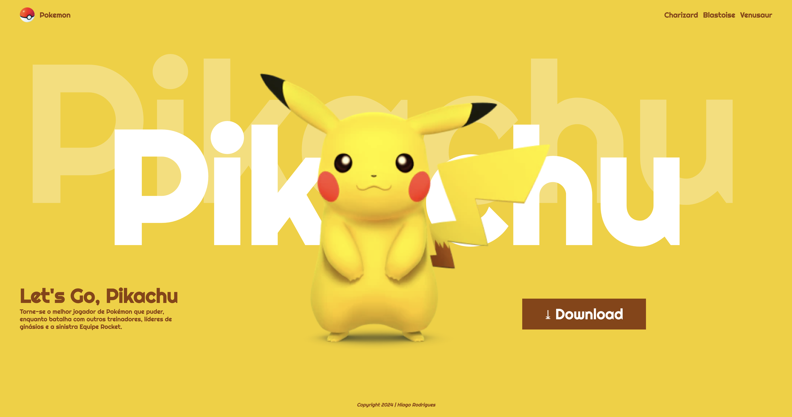

# Landing Page - Let's Go, Pikachu

---
## Sobre
Site do tipo landing Page para divulgar o jogo Let's Go, Pikachu.
O intuito deste jogo é colocar em prática o conhecimento adquirido sobre as linguagens de marcação, HTML, CSS e Markdown,realizadas no curso técnico de desenvolvimento de sistemas do [SENAI Jandira](https://sp.senai.br/unidade/jandira/)

---

## Tecnologias utilizadas
- HTML
- CSS 
- Markdown
- Git

---

## Autor
- [Hiago Rodrigues](https://www.linkedin.com/in/hiago-rodrigues-ortolan-8a3507327/)
